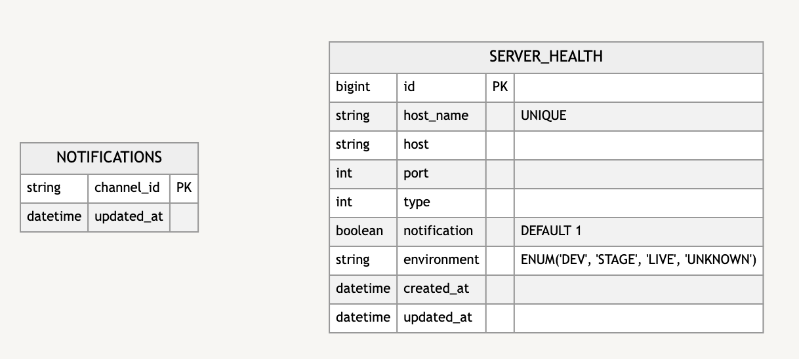
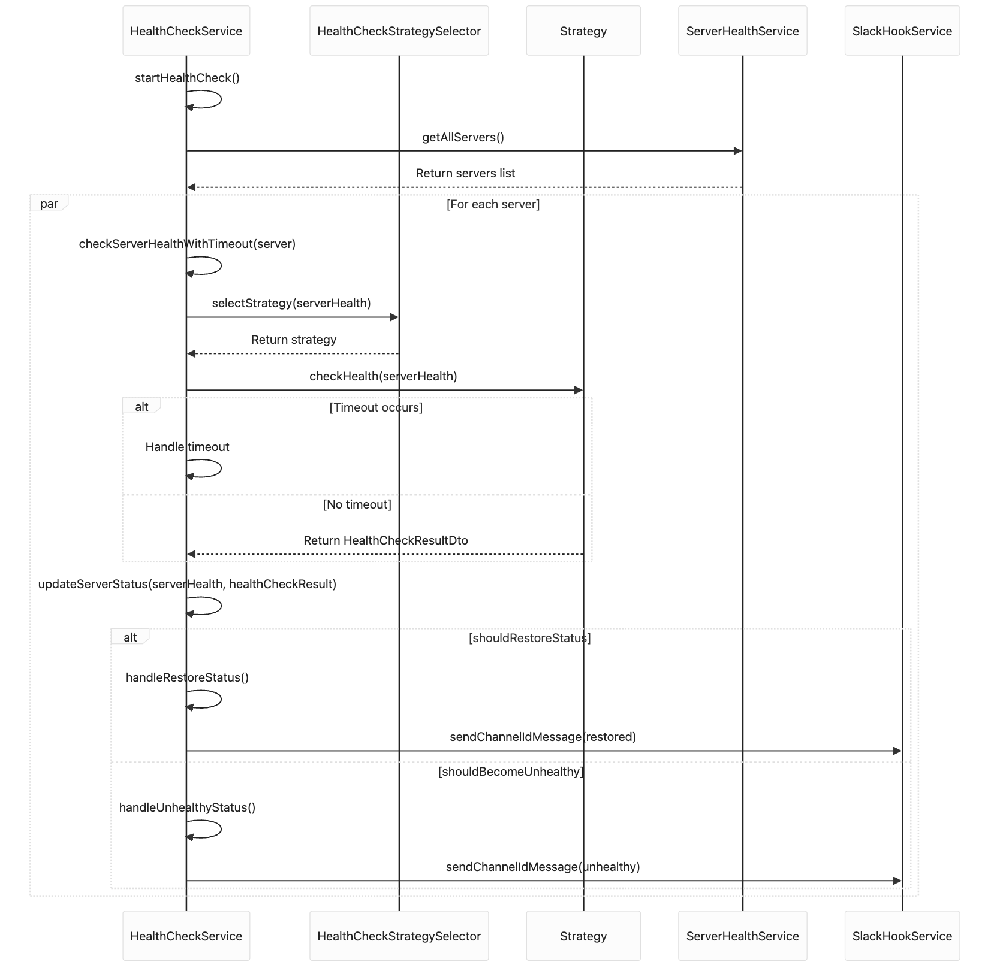

# 서버 헬스체크 페이지

### 목표:

웹/웹소켓 서버의 상태를 실시간으로 모니터링하고 장애 발생/해결 시 이를 슬랙 채널에 알림을 통보하는 시스템을 구축합니다.

본 프로젝트는 인턴 기간중 진행한 개인 프로젝트로 **회사 관련 코드를 제거한 뒤 허가를 받고 게시하였습니다.**

### 서비스 링크

#### https://health-check.shop/

### 주요 기능:

1. **헬스체크 대상 관리**
    - 수동 추가
    - 자동 추가(사내 내부 서버조회 API 연결시)
2. **장애 감지 및 알림**
    - 서버의 장애 발생 시 자동으로 알림 메시지를 슬랙으로 발송
    - 장애 발생 및 해제 시 알림
3. **알림 수신채널 관리**
    - 알림 메시지를 받을 슬랙 채널 관리
        - 채널 생성, 수정, 삭제기능이 필요
        - 여러 채널에 알림수신이 가능하도록

### 세부 기능 및 구현:

1. **헬스체크 대상 관리**
    - **서버 조회 API**
        - 서버 정보에는 서버 이름, IP 주소, 포트 등이 포함됨
    - **서버 상태 조회**
        - 등록된 서버의 현재 상태(정상, 장애)를 조회할 수 있는 기능
2. **장애 감지 및 알림**
    - **헬스체크 작업**
        - 일정 주기마다 등록된 서버들의 상태를 체크
            - 몇 초마다 상태를 조회할 것인지 설정이 가능해야 함
            - 응답 timeout 값을 커스텀하게 설정이 가능해야 함. (ex 3초이상 응답이 없으면 실패처리)
        - GET 요청 혹은 웹소캣 커넥션을 통해 확인한다
            - 서버 목록 데이터에서 타입이 2,3,4 인 경우는 웹소켓 커넥션을 통해 상태를 확인하고 1,6의 경우 GET Http Request로 확인한다
    - **장애 발생 시 슬랙 메시지 발송**
        - 서버의 상태가 비정상일 때 설정된 슬랙 채널로 알림 발송
        - 슬랙 메시지 내용에는 서버 이름, 장애 발생 시각, 장애 유형 등이 포함됨
    - **장애 해제 시 알림**
        - 장애 상태가 해제될 때에도 알림 발송
        - 해제 시점과 관련 정보를 포함
    - 알림 설정 ON/OFF
        - 장애가 감지되더라도 알림 설정을 끌 수 있는 ON/OFF 기능
3. **알림 수신채널 관리**
    - **채널 등록/수정/삭제 API**
        - 알림을 받을 슬랙 채널을 관리하는 RESTful API 제공
        - 채널 정보에는 slack api 를 통해 메시지를 보낼 hookUrl, 채널 이름이 포함됨
    - 채널 목록 조회
        - 현재 등록된 채널을 조회할 수 있는 기능
        - 알림 설정 유무를 확인할 수 있음

---

# 참고

### 슬랙 봇에 필요한 권한

```
- channels:read
- groups:read
- im:read
- mpim:read
- channels:manage
- groups:write
- im:write
- mpim:write
- chat:write
- chat:write.public
- chat:write.customize
```

---

# DDL

```sql
create table server_health
(
    id           bigint auto_increment
        primary key,
    host_name    varchar(255) not null,
    host         varchar(255) not null,
    port         int          not null,
    type         int          not null,
    notification tinyint(1) default 1 not null,
    environment  enum ('DEV', 'STAGE', 'LIVE', 'UNKNOWN') not null,
    created_at   timestamp default CURRENT_TIMESTAMP null,
    updated_at   timestamp null,
    constraint host_name
        unique (host_name)
);

create table notifications
(
    channel_id varchar(255)                       not null
        primary key,
    updated_at datetime default CURRENT_TIMESTAMP not null
);


```

# ERD



# 아키텍처 구성도


# API 문서

#### https://health-check.shop/swagger-ui/index.html

# 헬스체크 로직 시퀀스 다이어그램



# 트러블 슈팅 및 추가 설명 PDF

- assets/health-check.pdf 에 첨부하였습니다.

